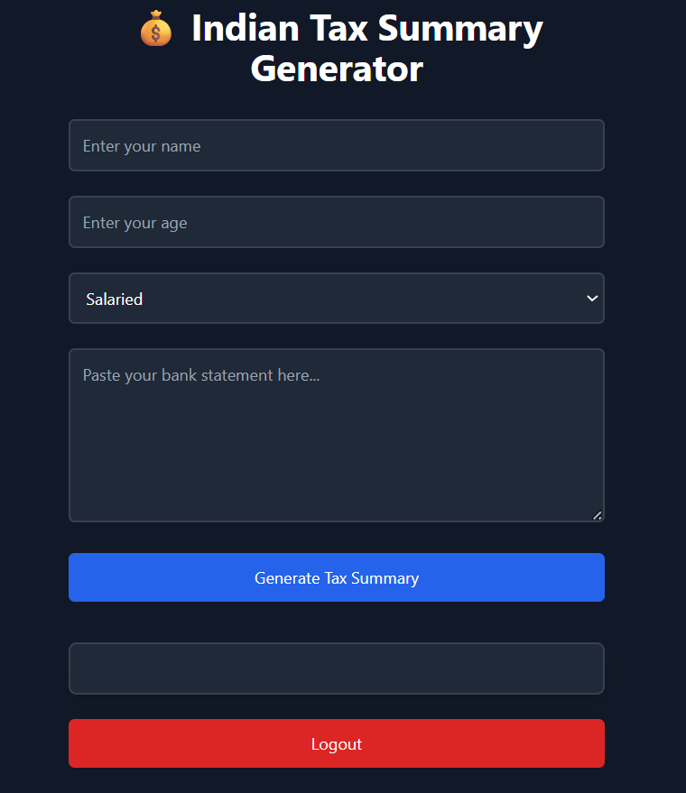

# 💰 Simplify Tax – Indian Tax Summary & Optimization Tool

**Simplify Tax** is an AI-powered tax filing and optimization tool designed to assist Indian taxpayers in understanding their tax obligations, maximizing deductions, and selecting the most beneficial regime. It reads bank statements, classifies income, calculates tax liabilities, and recommends the optimal tax-saving strategy — all automatically.

---

## 🚨 Problem Statement

Many taxpayers overpay their taxes due to a lack of awareness of all eligible deductions, credits, and tax-saving strategies. The current tax system's complexity makes it difficult for individuals and small businesses to proactively identify and leverage these opportunities.

**Simplify Tax** addresses this by offering an automated solution that analyzes financial data, extracts relevant information, and generates a clear tax summary — helping users save time, money, and effort.

---

## 🔍 AI Agents & Their Real-Life Equivalents

| AI Agent                   | Real-Life Equivalent                          |
|----------------------------|-----------------------------------------------|
| Document Parsing Agent     | Bank Statement Analyst / Data Entry Clerk     |
| Income Classifier Agent    | Income Tax Consultant                         |
| Deduction Agent            | Tax Saving Expert (80C, 80D Advisor)          |
| Tax Calculator Agent       | Chartered Accountant (CA)                     |
| Optimization Agent         | Financial Planner / Tax Strategist            |

---

## 🧠 Tech Stack Used

- **Frontend**: HTML, Tailwind CSS, JavaScript
- **Backend**: FastAPI (Python)
- **AI Agent Framework**: [CrewAI](https://github.com/joaomdmoura/crewAI)
- **LLM Provider**: Google Gemini via [LiteLLM](https://github.com/BerriAI/litellm)
- **Markdown Parsing**: Marked.js
- **CORS Handling**: FastAPI CORSMiddleware
- **Deployment-Ready**: Works locally and ready for platforms like Render, Railway, or Replit

---


## ⚙️ Setup Instructions

### 🔁 Prerequisites
- Python 3.9+
- Node.js (optional for advanced frontend tweaks)
- Virtual environment (recommended)


### 1️⃣ Clone the repository:
   ```bash
   git clone https://github.com/yourusername/simplify-tax.git
   cd simplify-tax
   ```


### 2️⃣ Install Dependencies

```bash
pip install -r requirements.txt
```


### 3️⃣ Add your API Key

Replace the API key in `main.py` (GeminiLLM class) with your own [Google AI Studio](https://makersuite.google.com/) API key.


### 4️⃣ Setup the FastAPI backend server:

First change your working directory to backend.
```bash
cd backend
```

Run the FastAPI backend:
```bash
uvicorn main:app --reload
```


### 5️⃣ Execute the Frontend:

Goto signup.html page using VS Code Live Server or any static file server and then do the required tasks to het the output.

### 6️⃣ Sample Inputs

This is the format for entering your bank statements.
Here is a sample:

   Salaried:

    - Salary from Microsoft: ₹2,00,000/month (CTC ₹24LPA)
    - Freelance Android App Development: ₹60,000 in June, ₹75,000 in October
    - Capital Gains from Mutual Funds: ₹1,20,000 in December
    - Interest from Savings Account: ₹12,000 over the year
    - Health Insurance Premium: ₹25,000/year
    - SIP to ELSS Mutual Funds: ₹10,000/month
    - Home Loan Principal Repayment: ₹1,50,000
    - Home Loan Interest Paid: ₹1,90,000
    - Rent Paid (self-occupied home, no HRA)
    - Donation to Akshaya Patra Foundation: ₹15,000
    - Purchase of NPS (National Pension Scheme): ₹50,000

---

## ✨ Features

- ✅ Upload and analyze your bank statement (text format)
- ✅ Auto-categorizes income sources and deductions
- ✅ Calculates tax liability under both regimes
- ✅ Compares and recommends the best regime
- ✅ Provides downloadable markdown summary
- ✅ Easy logout and clean UI

---

## 📁 File Structure

```
simplify-tax/
│
├── backend 
    └── main.py              # FastAPI backend with CrewAI agents
├── frontend
    ├── index.html            # Frontend HTML page
    ├── login.html            # Frontend for Login Page
    └── signup.html           # Frontend for Sign Up Page
├── requirements.txt         # Python dependencies
└── README.md                # You're here!
```

---

## 🛡️ Security Notes

- Sensitive data (e.g., API keys, bank statements) are processed locally.
- No data is stored on the server or in a database.

---

## 🛠️ Future Improvements

- PDF bank statement support via OCR
- Multi-year tax summary
- Integration with income tax portals
- Mobile responsiveness and PWA version
- Login and database for user history

---

## 📸 Demo Screenshot



---

## 📞 Contact

Built by **SRUJAN P R**  
Feel free to reach out for collaborations, ideas, or improvements.

[LinkedIn](https://www.linkedin.com/in/srujanpr) • [Email](sruja2401@gmail.com)

---

## 📜 License

This project is licensed under the MIT License.

---

## ⭐ Star this repo if it helped you!
